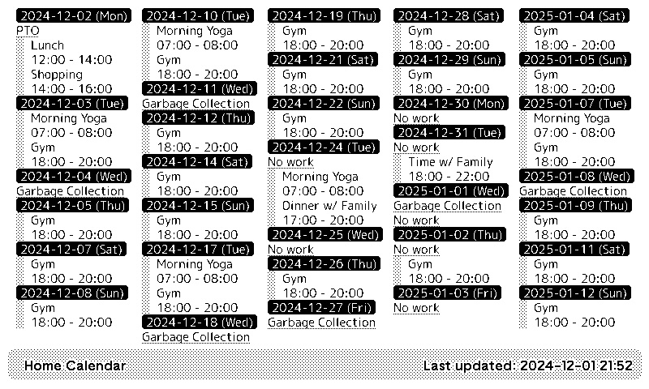

# Calendar plugin for TRMNL

A TRMNL plugin that fetches an ICS calendar and display events in a multi-column list format.



## Setup
1. At TRMNL, add a new Private Plugin
2. Choose strategy "Webhook", save the Plugin and copy "Webhook URL"
3. Click "Edit Markup" and populate it with the content of `template.html` file in this directory
4. Create `.env` file in this directory with the following content
```
TRMNL_TITLE="<title to display in title bar>"
TRMNL_WEBHOOK_URL=<your Webhook URL>
TRMNL_ICS_URL=<your calendar ICS url>
TRMNL_DAYS=30 # number of days to display
TRMNL_TZ="<your timezone>" # example: America/Los_Angeles
```
5. Run `main.py`

